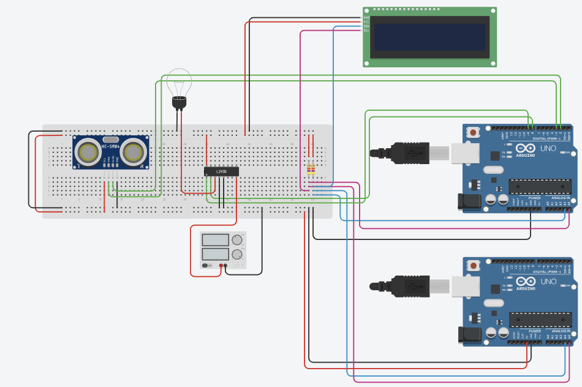
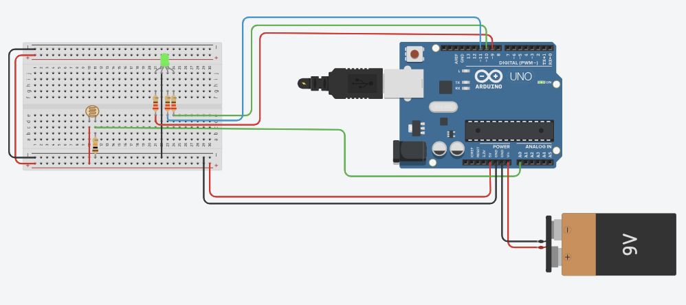

# Hardware Implementation - Dynamic Load Management System (DLMS)

The **Dynamic Load Management System (DLMS)** is a conceptual prototype designed to demonstrate intelligent energy distribution across multiple charging stations. This implementation utilizes an **Optical Power Transfer Simulation (OPTS)** to visualize power flow in a controlled environment without the complexities of high-power electrical hardware.

## System Overview
The system operates as a **Closed-Loop Optical Swarm**:
* **Variable Power Emission:** High-power 12V LED panels (10x10cm) simulate the charging pads. The **L298N H-Bridge** modulates light intensity via PWM, representing the allocated power.
* **Dynamic Load Balancing:** A **Raspberry Pi 4 (Master Node)** orchestrates the swarm, calculating optimal power for each station based on real-time telemetry.
* **Active Feedback:** The vehicle detects light intensity via an under-chassis **Photoresistor (LDR)** and displays its status:
    * 🔴 **Red LED:** Fast Charging (High Power / SoC ≤ 30%)
    * 🟡 **Yellow LED:** Standard Charging (Medium Power / 30% < SoC ≤ 80%)
    * 🟢 **Green LED:** Trickle Charging (Low Power / SoC > 80%)

## Hardware Components

### Infrastructure (Ground Level)
* **Raspberry Pi 4 Model B:** Master Node & Bridge. Manages swarm logic and Cloud data uplink.
* **Arduino UNO (x2):** Slave Nodes. Handles local station hardware (Sensors & PWM).
* **HC-SR04 Ultrasonic Sensor (x2):** Detects vehicle presence for "Plug-and-Charge" automation.
* **L298N Driver Module (x2):** Acts as a solid-state relay and PWM controller for the power simulation.
* **12V LED Panel 10x10cm (x2):** High-intensity flat light source for energy simulation.
* **INA219 Current Sensor (x2):** Monitors real-time voltage and current ($P=V \times I$) for ML model training.
* **12V Power Supply:** Main bus for the LED panels and L298N drivers.

### Smart Vehicle (Agent)
* **Arduino Nano:** Processes LDR data and simulates battery SoC progression.
* **Photoresistor (LDR):** Captures light intensity from the station pad.
* **RGB / Status LEDs:** On-board UI for charging speed visualization.
* **9V Battery:** Dedicated power for the vehicle's logic and sensors.

## Data Acquisition for Machine Learning
The **INA219** sensors provide the critical dataset for the predictive model. Every session is logged by the Raspberry Pi, recording:
1. **Power Draw Profile:** How much energy is requested vs. delivered.
2. **Efficiency Metrics:** Influence of swarm saturation on individual charging speeds.
3. **Occupancy Patterns:** Used to train the ML model to predict future congestion at specific hours.

## Tinkercad Simulation
To facilitate rapid prototyping and testing, the entire DLMS setup is replicated in **Tinkercad**. 

### Cyrcuit A -> DLM hub

- **Communication between Raspberry Pi and Arduino UNO**
    The communication between the Raspberry Pi and Arduino UNO is simulated using two arduinos, because Tinkercad does not support Raspberry Pi simulation. 
    The comunication uses the I2C protocol, so the wiring is as follows:
    - **Arduino UNO (Master):**
        - **`A4` (SDA)** -> line 60 of the breadboard 
        - **`A5` (SCL)** -> line 61 of the breadboard
    - **Arduino UNO (Slave):**
        - **`A4` (SDA)** -> line 60 of the breadboard
        - **`A5` (SCL)** -> line 61 of the breadboard
    - **GND** of both arduinos connected to the ground line of the breadboard
    - **5V** of Arduino UNO (Master) connected to the power line of the breadboard
    - Resistor of **4.7k ohm** between line 60 and power line of the breadboard
    - Resistor of **4.7k ohm** between line 61 and power line of the breadboard
- **HC-SR04 Ultrasonic Sensor**
    - **VCC** -> power line of the breadboard
    - **GND** -> ground line of the breadboard
    - **Trig** -> pin 2 of Arduino UNO (Master)
    - **Echo** -> pin 3 of Arduino UNO (Master)
- **L298N Driver Module**
    The L298N Driver Module was simulated using L293D Motor Driver.
    - **Pin 16 - Alimentation 1** -> power line of the breadboard
    - **Pin 8 - Alimentation 2** -> power supply set to 12V and 5A 
    - **Pin 4 & 5 - GND** -> the two ground in the bottom are connected to the ground line of the breadboard
    - **Pin 1 - Enable 1 and 2** -> pin 9 of Arduino UNO (Slave)
    - **Pin 2 - Input 1** -> pin 8 of Arduino UNO (Slave)
    - **Pin 3 - Output 1** -> positive of the LED Panel
- **12V LED Panel**
    - **Positive** -> Pin 3 (Output 1) of L298N Driver Module
    - **Negative** -> ground line of the breadboard
- **LCD I2C Display 16x2**
    - **VCC** -> power line of the breadboard
    - **GND** -> ground line of the breadboard
    - **SDA** -> line 60 of the breadboard
    - **SCL** -> line 61 of the breadboard
> In real implementation, the INA219 Current Sensor would be connected between the power supply and the L298N Driver Module to monitor voltage and current.

### Circuit B -> Smart Vehicle
- **Photoresistor (LDR)**
    - **Catod** -> power line of the breadboard
    - **Other leg** -> pin A0 of Arduino Nano and to a resistor of 10k ohm
    - **Resistor of 10k ohm** -> ground line of the breadboard
- **RGB / Status LEDs**
    - **Red Pin:** Connected to pin 9 of Arduino Nano through a resistor of 220 ohm
    - **Green Pin:** Connected to pin 10 of Arduino Nano through a resistor of 220 ohm
    - **Blue Pin:** Connected to pin 11 of Arduino Nano through a resistor of 220 ohm
- **9V Battery**
    - **Positive** -> Vin of Arduino Nano
    - **Negative** -> GND of Arduino Nano

